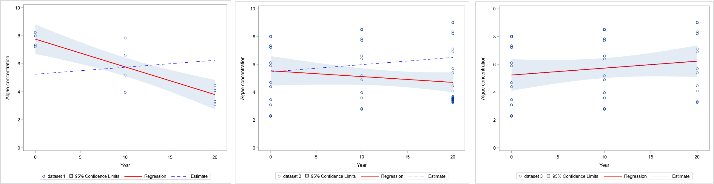
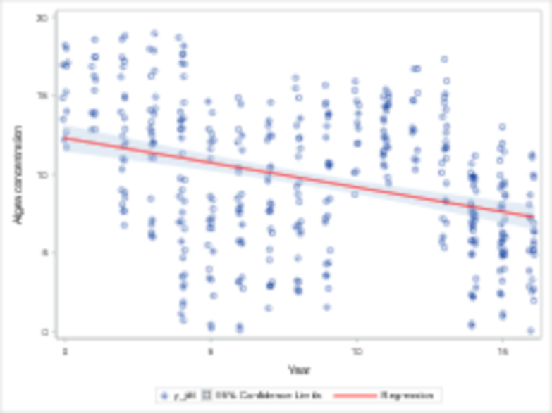
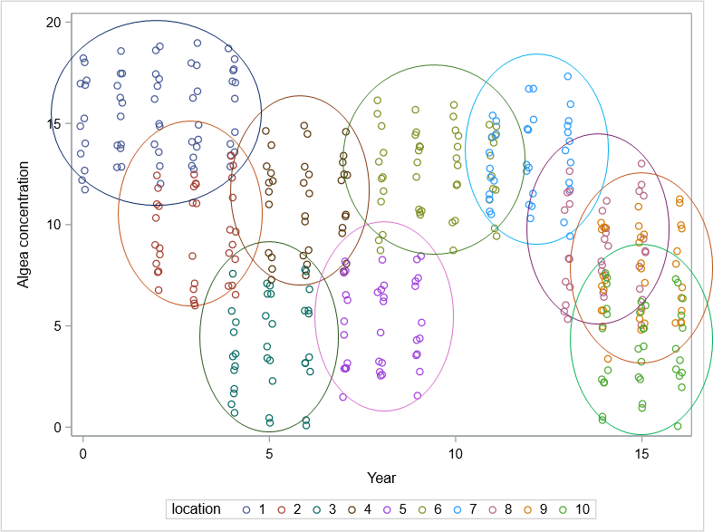
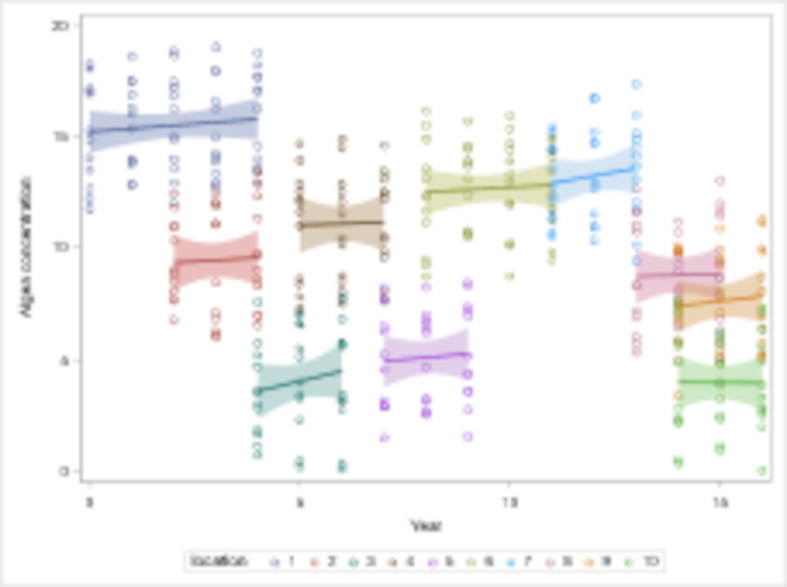
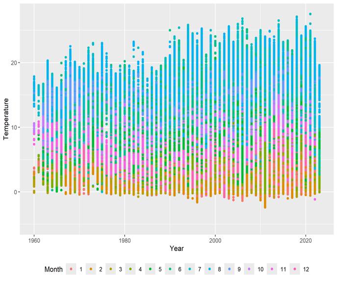
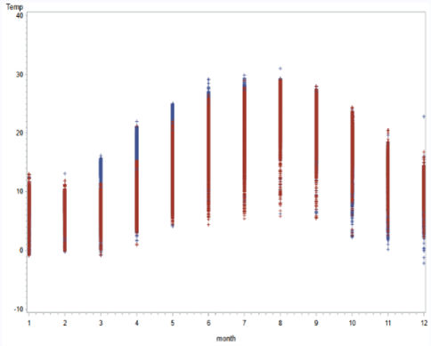
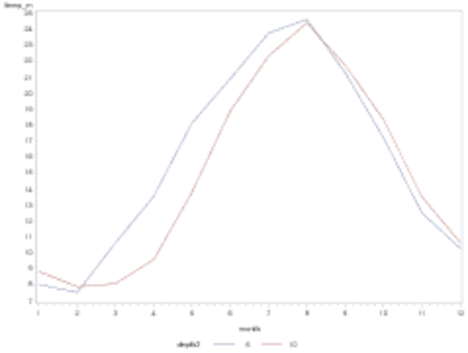

### Why simple regression often fails

When you are interested in finding a simple trend in your dataset, why bother setting up a complex statistical model? And when you have a very large dataset, is it even necessary? The short answer is ‘yes’ - it is important to include variables that significantly influence the output variable - especially when data are imbalanced or incomplete, which is often the case for survey data. An imbalanced dataset is one that is unevenly distributed across some of the variables. By an incomplete data structure, we mean a dataset that does not have full rank; that is, it lacks observations for all combinations of variables. By adjusting for other variables in your model, you get a much more accurate picture of the underlying trend, and the results are much more reliable. 

In the following, three examples for normally distributed data are given, two are manually generated and one from a case study. The first example illustrates the challenges with imbalanced and incomplete data, the second example illustrates why including random variables can be crucial, and the third example comes from a study analyzing surface temperature data from European seas, which is an imbalanced and incomplete dataset with a more complex variance structure.

Applying a statistical model not only increases the reliability of the trend estimate but also provides deeper insight into the data. NIVA has a strategy of providing research and consulting services of the highest quality. Maintaining and continuously improving this high standard is essential for remaining a competitive and attractive partner.

### Example 1. Incomplete and imbalanced datasets

To illustrate how a simple regression model can fail, consider the following example of chlorophyll concentration (µg/l) in lakes. Two datasets are generated from a third dataset which has full rank and is balanced. The trends for each of them are determined based on three years of observations. In the first dataset, the dataset is incomplete: the first year only contains summer data, the second only late summer, and the third only winter. A simple regression accounting only for the 'Year' results in a false decreasing slope due to this seasonal bias. The second dataset has full rank (observations for every month for every year), but it is heavily imbalanced. While most months have one observation, January in the third year has 100. Because this large cluster of winter data pulls the average down, the simple regression again shows a misleading downward trend. The third dataset serves as the control, with one observation for every month across all three years. The resulting slopes for the three datasets (red lines in the figures below) are -0.40 µg/l per year (left figure), -0.21 (center figure), and 0.05 (right figure), respectively. However, once 'Month' is included as a variable in the models, the estimated slopes (blue dashed lines) for the first two datasets become identical to the slope in the third dataset which is complete and balanced. This means that even if a dataset is imbalanced and/or incomplete, it is still possible to obtain an accurate estimate by applying an appropriate statistical model. Moreover, showing estimated slopes from a statistical model alongside raw data can be very confusing if the dataset is imbalanced or incomplete which most surveys datasets are.

{#fig1}

### Example 2. Including other important variables in the model e.g. as random variables

Consider a dataset which has observations of chlorophyll concetration (for example) for every month of every year but are not balanced between year; some years have 12 observations, while others have 24 or 36. Initially, the trend is estimated using two methods: a simple regression (Year only) and a model accounting for both Year and Month. Because the imbalance is minor, the resulting trend estimates are nearly identical (-0.312 and -0.313, see figures on the next page, left and center). However, these models overlook a critical factor: sampling location. In this dataset, location significantly influences the output variable (Figure top-right). Whether a site is near a sewer pipe, an agricultural field, or a lake inlet, may have a significant influence on the output variable, however, this specific environmental information is often unknown; only the location names (1-10) are given. To obtain a reliable trend, 'Location' must be included in the model. Since the primary goal is to determine a general trend rather than the specific concentration at each site, 'Location' is best treated as a random effect rather than a fixed effect, especially if the number of locations is large. While the choice between fixed or random effects does not alter the trend estimate itself, it significantly impacts uncertainty estimates and model convergence. As shown in the bottom figure, while individual slopes for each location are plotted, there are no significant differences between them, resulting in a common estimated slope of 0.144. Now that 'Location' is included in the model the dataset has become incomplete since each location does not have measurements from all the 16 years in the dataset.

|  |  |  |
|----|----|----|
| {#fig2a} | {#fig2b} | {#fig2c} |

### Example 3. Trend in temperature for European seas. Large dataset

Real life survey data are often complex, and it is often a matter of getting the best out of messy data. It is therefore essential to understand the underlying drivers of the data, which structures might be hidden within, what type of distribution the output variable has (normal, lognormal, something else?), and whether important information is missing that may influence the results. Before setting up a model, a useful first step is to explore the data visually and develop an overview of the available variables, including their levels and potential relevance. In the left figure below, the temperature is plotted as a function of years and colored by the month of sampling. From this it is clear to see that Month is an important variable. When the same plot is colored by sampling depth, no clear pattern emerges. However, when temperature is plotted against a stronger variable than Year, and especially when the data are appropriately aggregated, clearer patterns appear. These visualizations (center and right figures below) suggest that Depth may also play an important role according to temperature. Depth was divided into two categories (0-5 meters or 5-10 meters) and aggregation was performed by averaging over observations from the same date, at the same station, and within the same depth category.

|  |  |  |
|----|----|----|
| {#fig3a} | {#fig3b} | {#fig3c} |

Another variable examined was Originator (i.e. the institute or company responsible for the sampling process). The number of originators in the dataset was large (245 levels), making it unsuitable to include as a fixed effect in the model. Instead, it was incorporated as a random effect. The data structure of the Originator is more or less as illustrated in the center figure in example 2. Additional variables included in the model were Region, Water type (coastal/offshore), and Day (day in the month), along with their two-way interactions. If the data were analyzed using a simple regression model including only Year as an explanatory variable, the estimated trend would suggest an increase of 6.9°C from 1960 to 2023. However, when applying a more comprehensive statistical model that accounts for the relevant variables identified in the dataset, the estimated increase is reduced to 1.3°C.

### About

Helle is a statistician with **X** years experience from...

